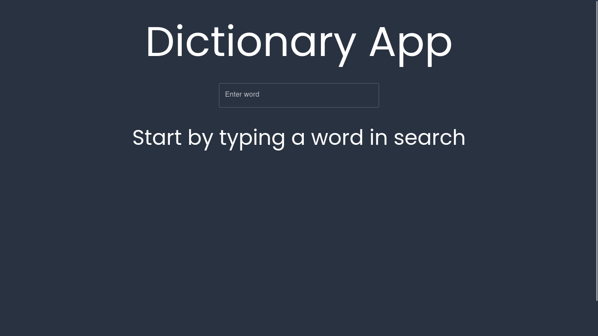
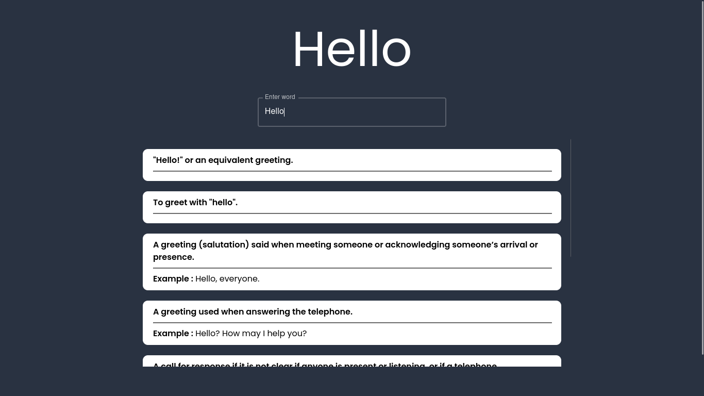

# Word finding application

This is a simple word finding application that uses the [Dictionary API]() to find the definition of a word.

## Live Demo

The live demo can be found [here](https://word-lookup.netlify.app/).

## How to use

- Clone the repository
- Run `npm install` to install the dependencies
- Run `npm start` to start the application

## Technologies used

- React
- Material UI
- Axios
- Unofficial Google dictionary API
- Netlify

## Screenshots

